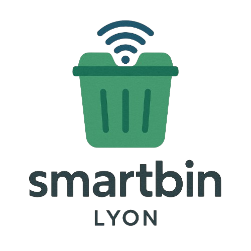

# SmartBin



## À propos de SmartBin

SmartBin est une solution innovante de gestion intelligente des déchets urbains développée par des étudiants de CPE Lyon. Notre plateforme permet de surveiller en temps réel le niveau de remplissage des poubelles dans la ville de Lyon, améliorant ainsi l'efficacité de la collecte des déchets et contribuant à un environnement urbain plus propre.

## Fonctionnalités Principales

- **Suivi en temps réel** - Visualisez le niveau de remplissage de chaque poubelle sur une carte interactive
- **Recherche intelligente** - Recherchez une poubelle par son identifiant ou par adresse
- **Historique des données** - Accédez à l'historique de remplissage pour chaque poubelle
- **Alertes de niveau** - Identification visuelle des poubelles qui nécessitent une attention immédiate
- **Tableau de bord analytique** - Statistiques globales sur le réseau de poubelles
- **Prédiction de remplissage** - Estimation des dates critiques pour optimiser les collectes
- **Itinéraires optimisés** - Calcul du parcours optimal pour la collecte des poubelles

## Technologies Utilisées

### Backend
- **PHP** - Architecture MVC pour l'API RESTful
- **Twig** - Système de templating pour les vues
- **PostgreSQL** - Base de données relationnelle pour le stockage des données

### Frontend
- **HTML/CSS/JavaScript** - Interface utilisateur responsive
- **Leaflet.js** - Bibliothèque pour l'affichage des cartes interactives
- **Chart.js** - Visualisation dynamique des données historiques

### Infrastructure
- **Docker** et **Docker Compose** - Conteneurisation des services
- **Nginx** - Serveur web haute performance

## Installation

### Prérequis
- Docker et Docker Compose installés sur votre système
- PHP 8.0 ou supérieur (pour le développement local)
- Composer (gestionnaire de dépendances PHP)

### Étapes d'installation

1. Cloner le dépôt
   ```bash
   git clone https://github.com/votre-compte/smartbin.git
   cd smartbin
2. Installer les dépendances
```bash
cd site-php
composer install
```

3. Configuration 

```bash
cp .env.example .env
# Modifier les variables d'environnement selon votre configuration
```

4. Lancer les conteneurs Docker


```bash
docker-compose up -d
```

5. Accéder à l'application

- Interface web : http://localhost:8080
- Administration de la base de données : http://localhost:5050

Commandes utiles

Pour mettre à jour les niveaux des poubelles avec les données les plus récentes :
```bash 
php src/Commands/SyncBinLevels.php
```

## Notre Équipe

SmartBin a été développé dans le cadre d'un projet étudiant à CPE Lyon par une équipe de développeurs passionnés et engagés pour l'environnement.

- **Lapointe Matthias** - Étudiant 4A - CPE Lyon
- **Ta Jonathan** - Étudiant 4A - CPE Lyon
- **Vincent Corentin** - Étudiant 4A - CPE Lyon
- **Thouvenel Romain** - Étudiant 4A - CPE Lyon
- **Voye Jean Baptiste** - Étudiant 4A - CPE Lyon
- **Piccinali Jeanne** - Étudiante 4A - CPE Lyon
- **Zory Leo** - Étudiant 4A - CPE Lyon

## Objectifs Futurs

- **Capteurs IoT** - Intégration de capteurs connectés pour des mesures en temps réel
- **Application mobile** - Interface dédiée pour les utilisateurs et équipes de collecte
- **Algorithmes prédictifs avancés** - Amélioration des modèles d'estimation du remplissage
- **Extension géographique** - Déploiement du système dans d'autres villes et régions


## Licence

Ce projet est développé dans un cadre éducatif à CPE Lyon. Tous droits réservés.